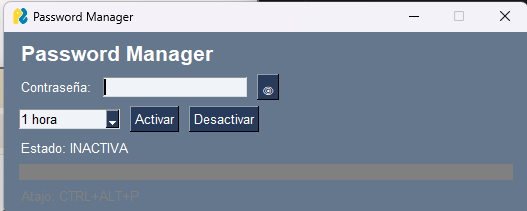

🌐 [Español](README.es.md) | **Español**

# 🔐 Password-hotkey — Password Manager with Timer

A desktop app in Python that lets you activate a password for a limited time and type it anywhere using a keyboard shortcut — without ever touching the clipboard.

---

## How it works

1. Type your password in the interface
2. Choose the duration: **15min, 30min, 1h or 4h**
3. Click **Activate** — the field locks and the hotkey becomes active
4. Go to any field (browser, app, etc.) and press **Ctrl + Alt + P**
5. The password is typed automatically, **bypassing the clipboard entirely**
6. Click **Deactivate** when you're done

> 💡 The password **never touches the clipboard**. It is typed character by character directly into the target field, so it never appears in `Win + V` history.

---

## Screenshots



---

## Requirements

- Python 3.10+
- Windows (recommended) or Ubuntu with Xorg

---

## Installation

### 1. Clone the repository

```bash
git clone https://github.com/CapiMouse/password-hotkey.git
cd password-hotkey
```

### 2. Create virtual environment and install dependencies

**With `uv` (recommended):**
```bash
uv venv
uv pip install -r requirements.txt
```

**With classic `pip`:**
```bash
python -m venv venv
venv\Scripts\activate        # Windows
source venv/bin/activate     # Linux
pip install -r requirements.txt
```

### 3. Run

```bash
# With uv
uv run python main.py

# Or directly
python main.py
```

> ⚠️ **Windows**: If the keyboard shortcut doesn't respond, run as **Administrator**.

> ⚠️ **Ubuntu**: Requires an **Xorg** session (not Wayland). At login, select *"Ubuntu on Xorg"*.

---

## Usage

| Action | Description |
|--------|-------------|
| Type password | Masked text field (👁 to show/hide) |
| Choose duration | Dropdown: 15min, 30min, 1h, 4h |
| `Activate` | Enables the hotkey and locks the field |
| `Ctrl + Alt + P` | Types the password into the active field |
| `Deactivate` | Manually disables the hotkey |
| Close window | Automatically deactivates everything |

The countdown and progress bar update every 500ms. A popup appears when the session expires.

---

## Features

- ⏱ **Configurable timer**: 15min, 30min, 1h or 4h
- 👁 **Show/hide password**: button to temporarily reveal the input
- 🔒 **Locked field**: cannot be edited while the session is active
- 📊 **Progress bar**: visual indicator with dynamic colors (green → orange → red)
- ⏰ **Expiry popup**: automatic notification when the session ends
- 🔐 **Clipboard-free**: password is typed directly, never stored in `Win + V`

---

## Project Structure

```
password-hotkey/
├── main.py                  # Entry point + GUI
├── config.py                # Global constants
├── core/
│   ├── __init__.py
│   ├── password_manager.py  # State and timer logic
│   └── hotkey_handler.py    # Ctrl+Alt+P listener
├── requirements.txt
├── CLAUDE.md                # Internal technical documentation
└── README.md                # This file

```
This repository includes a CLAUDE.md file with technical guidance for developers using Claude Code to contribute to or extend this project.

---

## Tech Stack

| Library | Purpose |
|---------|---------|
| [PySimpleGUI](https://pysimplegui.readthedocs.io/) | GUI interface |
| [keyboard](https://github.com/boppreh/keyboard) | Global hotkeys + direct typing |

---

## Design Decisions

- **No persistent storage** — the password lives only in RAM during the session
- **No encryption** — single-use app in a trusted environment
- **No clipboard** — `keyboard.write()` types directly, avoiding `Win + V` history
- **Conditional hotkey** — only works when explicitly activated
- **Locked field on activate** — prevents accidental changes during the session

---

## Build `.exe` (Windows)

```bash
uv add pyinstaller --dev
pyinstaller --onefile --windowed --name "password-hotkey" main.py
```

The executable will be generated in the `dist/` folder.

---

## Known Limitations

- Does not work on Ubuntu with **Wayland** (use Xorg instead)
- May require **Administrator** privileges on Windows
- `keyboard.write()` may fail with uncommon Unicode characters depending on the system keyboard layout

---

## License

MIT — free for personal use and modification.